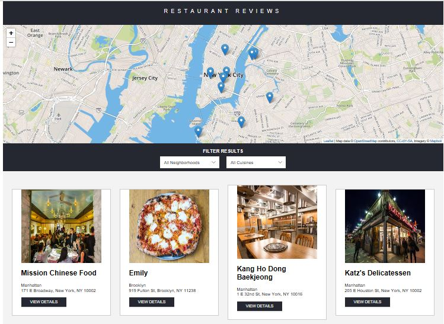
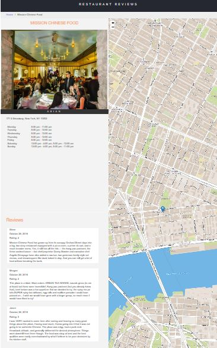

# Restaurant Reviews App - stage 1 - Heba Fahmi Kurdia

## Project Overview:

This is a project for the Udacity Front-End Web Developer
Nanodegree program. The objective of the project is to take an app that is not working very well and make it fully
responsive and accessible to users for all type of devices. 
The app should also be able to work when the network connection
is down or poor.

## Description about project:

1. User can select from a range of neighbourgoods and cuisines   
and a number of restaurants suggestions appear according to 
selections. 
2. Upon selecting a specific restaurant user receives
information for the restaurant such as:
Address, cuisine, oppening hours, other user reviews and ratings. 

## How to run the project:

1. Clone the GitHub repository localy.

2. Go into the "restaurant-reviews-app-stage-1" folder

	1. Opent the "index.html" file to display all restaurant in the project.
    2. When you to enter on the restaurant details click "VIEWDETAILS" button under the image of the restaurant.
	3. The "restaurant.html" page will open.
    4. When you want to back in the home page, click "Home" above of the restaurant image.
 
 ## Demo
 ## Home Page

 ## Restaurant Page

    
## Note:
files in order to be able to run project in local server.

3. Project needs a local server to run. 
	1. Open a bash command line window in the repository folder. 
	2. Check if python is installed in your computer by typing `python -V` or `py -V`. If you don't have Python installed, navigate to Python's [website](https://www.python.org/) to download and install the software.
	3. If you have Python 2.x, spin up the server with `python -m SimpleHTTPServer 8000` (or some other port, if port 8000 is already in use.) For Python 3.x, you can use `py -m http.server 8000` or `python3 -m http.server 8000`.

4. When you have a server up and running, open your browser and
visit the site: `http://localhost:42928` or depends on the server in your computer.

5. App is currently running on Github Pages. Change comments
in index.html, restaurant.html and dbhelper.js to run localy.

## Dependencies

The starter code for this project enter the link below
(https://github.com/HebaFahmi/restaurant-reviews-app-stage-1-HebaFahmi.git)

### Leaflet.js and Mapbox:

This repository uses [leafletjs](https://leafletjs.com/) with [Mapbox](https://www.mapbox.com/). Mapbox is free to use, and does not require any payment information. 

